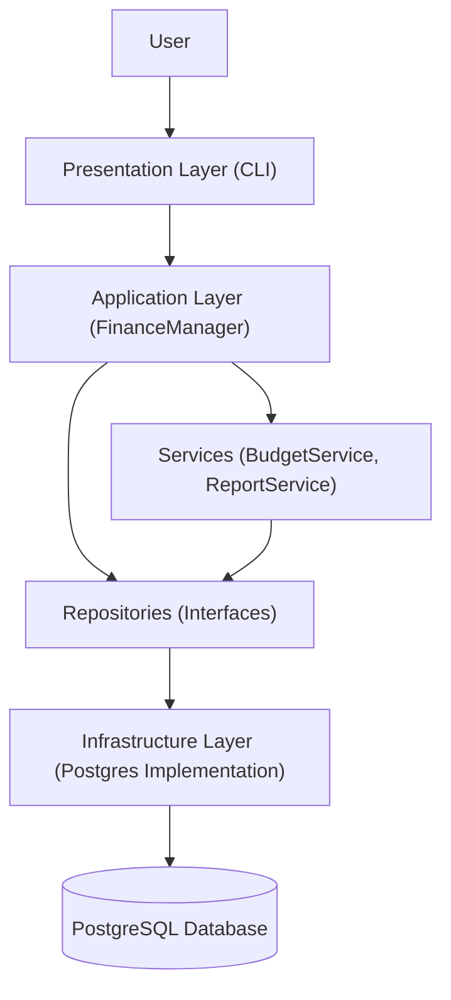

# System Architecture

The Personal Finance Tracker follows a **Layered Architecture** to ensure separation of concerns, maintainability, and scalability. This architecture decouples the user interface, business logic, and data access layers.

## High-Level Overview

## Layers Description

### 1. Presentation Layer (`src/presentation`)
*   **Role**: Handles all user interactions. It displays menus, accepts input, and formats output.
*   **Component**: `CLI` class.
*   **Dependency**: Depends only on the **Application Layer** (`FinanceManager`, `ReportService`). It knows nothing about the database or domain entities' internal logic.

### 2. Application Layer (`src/application`)
*   **Role**: Orchestrates business use cases. It acts as a bridge between the Presentation and Domain layers.
*   **Components**:
    *   `FinanceManager`: A **Facade** that provides a simplified API for the CLI. It manages transactions and coordinates with other services.
    *   `BudgetService`: Encapsulates logic for setting and checking budgets.
    *   `ReportService`: Manages report generation using the **Strategy Pattern**.
*   **Dependency**: Depends on **Domain Layer** (Entities, Repository Interfaces).

### 3. Domain Layer (`src/domain`)
*   **Role**: The core of the system. Defines the business objects and rules. It is pure C++ and has **zero dependencies** on external frameworks or databases.
*   **Components**:
    *   **Entities**: `User`, `Transaction` (Abstract), `Income`, `Expense`, `Budget`.
    *   **Value Objects**: `Money`, `Date`.
    *   **Repository Interfaces**: `IUserRepository`, `ITransactionRepository`, `IBudgetRepository`.
    *   **Factories**: `TransactionFactory`.

### 4. Infrastructure Layer (`src/infrastructure`)
*   **Role**: Provides concrete implementations for the interfaces defined in the Domain Layer. Handles external concerns like Database and File I/O.
*   **Components**:
    *   **Repositories**: `PostgresUserRepository`, `PostgresTransactionRepository`, `PostgresBudgetRepository`.
    *   **Database**: `PostgresConnection` (**Singleton**).
    *   **Strategies**: `CsvReportStrategy`.
*   **Dependency**: Depends on **Domain Layer** and external libraries (`libpqxx`).

## Key Design Decisions
*   **Dependency Injection**: Dependencies (like Repositories) are injected into Services/Facade, allowing for easy testing and swapping of implementations.
*   **Interface-Based Design**: The Application layer relies on Repository Interfaces (`I...Repository`), not concrete classes. This adheres to the **Dependency Inversion Principle**.
