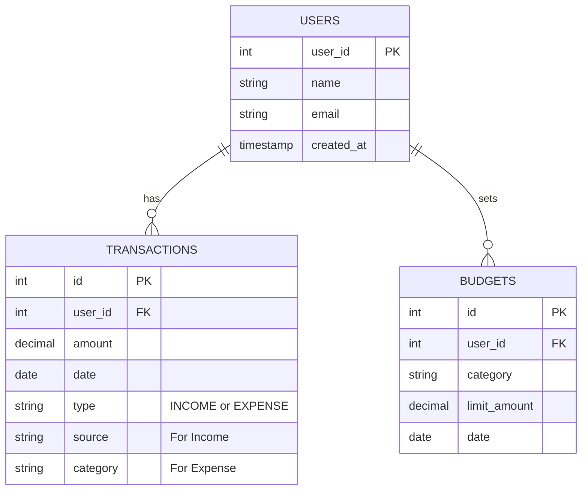

# Database Schema

The system uses **PostgreSQL** for persistent storage. The schema is designed to support users, transactions (incomes/expenses), and budgets.

## ER Diagram

## Table Definitions

### 1. `users`
Stores user account information.

| Column | Type | Constraints | Description |
| :--- | :--- | :--- | :--- |
| `user_id` | SERIAL | PRIMARY KEY | Unique identifier |
| `name` | VARCHAR(100) | NOT NULL | User's full name |
| `email` | VARCHAR(100) | UNIQUE, NOT NULL | User's email address |
| `created_at` | TIMESTAMP | DEFAULT NOW() | Account creation time |

### 2. `transactions`
Stores both incomes and expenses.

| Column | Type | Constraints | Description |
| :--- | :--- | :--- | :--- |
| `id` | SERIAL | PRIMARY KEY | Unique identifier |
| `user_id` | INT | FK -> users(user_id) | Owner of transaction |
| `amount` | DECIMAL(10,2) | NOT NULL | Monetary value |
| `date` | DATE | NOT NULL | Date of transaction |
| `type` | VARCHAR(10) | CHECK (INCOME/EXPENSE) | Discriminator column |
| `source` | VARCHAR(100) | NULLABLE | Source (if Income) |
| `category` | VARCHAR(100) | NULLABLE | Category (if Expense) |

### 3. `budget`
Stores monthly budget limits per category.

| Column | Type | Constraints | Description |
| :--- | :--- | :--- | :--- |
| `id` | SERIAL | PRIMARY KEY | Unique identifier |
| `user_id` | INT | FK -> users(user_id) | Owner of budget |
| `category` | VARCHAR(50) | NOT NULL | Budget category |
| `limit_amount` | DECIMAL(10,2) | NOT NULL | Spending limit |
| `date` | DATE | NOT NULL | Start date of budget |
| `created_at` | TIMESTAMP | DEFAULT NOW() | Record creation time |

## Connection Management
*   **Library**: `libpqxx`
*   **Configuration**: Connection string stored in `config/database.env`.
*   **Pattern**: Singleton pattern ensures only one connection pool/instance is active.
